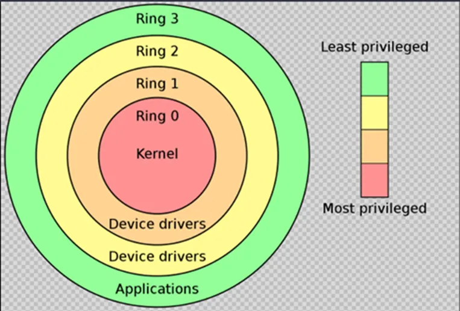
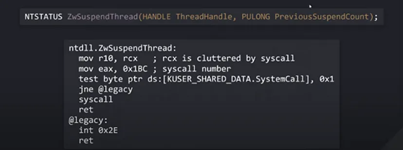
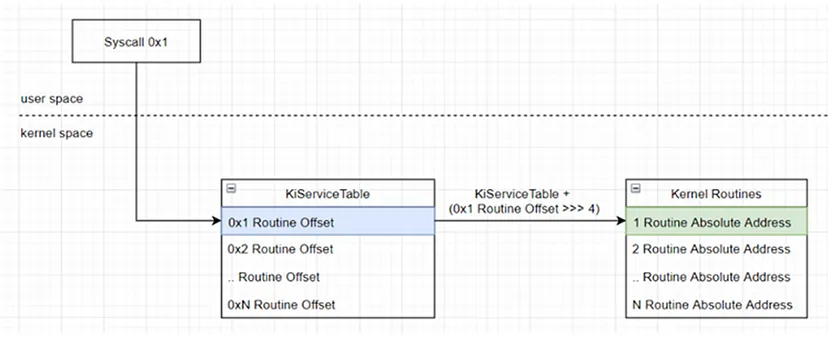
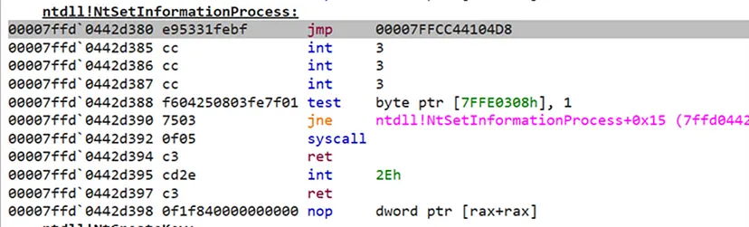

# Intro to Syscalls & Windows internals for malware development Pt.1

Hello Everyone, over the years I’ve written many articles/summaries that for some reason I kept to myself and didn’t think to share them.
The summaries are from all over the spectrum of cyber security, from Windows privilege escalation & Active Directory, web application exploitation, HackTheBox machines writeups, all the way to heap exploitation, reverse engineering and Windows Internals. Once in a while I’ll publish more posts.

The Windows Operating System is divided to 2 modes: user-mode and kernel-mode and are described by using 4 rings as the following:

**User-Mode** — resides on rings 1–3. Ring 3 is where applications are being executed from.

**Kernel Mode** — resides on ring 0. Kernel Mode is the most privileged and it is the area where the kernel operates. Most of the programs are not and should not operate directly on Ring 0.

Every program will somehow need to interact with the kernel in order to run properly for things such as memory allocation, File Creation, Memory permissions modificiation, etc. In order to safely do that, Windows have some kind of bridge that will safely transfer instructions to the kernel.
That bridge is consisted out of 3 steps:
**Win32 API** → **Native API** → **Kernel**

Win32 API is the main API that is being used as a bridge to the Native API and from there, to the kernel. The WIN32 API is constructed from DLLs (Dynamic Link Librarys — such as kernel32.dll) and each DLL includes functions inside them that are being called and invokes the Native API in order to transfer execution to kernel mode.

The Native API (“ntdll.dll”) is the closest user-mode functionality to the kernel and is responsible for making the transition between user-mode and kernel-mode. The transition from user-mode to kernel-mode is being performed through the “syscall” instruction that resides in each Native API fucntion found in NTDLL.dll:

https://www.youtube.com/watch?v=I_nJltUokE0&t=2208s 

The “**syscall**” instruction needs to be specified with a special number (stored in the eax 32-bit register) that the kernel requires in order to execute the correct routine. This number is called System Service Number (SSN) and using that number, the kernel mode performs some mathematical operations and knows what kernel subroutine it needs to execute in order to fill the program’s requirement.

System Service Dispatch Table (SSDT) is a special table that resides in the kernel mode and is responsible to match the syscall number received from the Native API to the kernel subroutine that was required to fulfill the application’s request. SSDT matches the SSN to the appropriate kernel subroutine through the following mathematical operation:

* **KiServiceTableAddress** = Base address of the **SSDT table**.
* **RoutineOffset** = System Service Number that was passed from the Native API.

https://www.ired.team/miscellaneous-reversing-forensics/windows-kernel-internals/glimpse-into-ssdt-in-windows-x64-kernel

When a process is created, one of the first things that are being loaded and allocated into the virtual address space of the process is the ntdll.dll which is the DLL that includes all the Native API functions. During process initialization in an environment that includes EDR (**Endpoint-Detection-Response**), the **EDR** injects a code to some functions inside the ntdll.dll that redirects the flow of execution into an EDR’s DLL, which will allow it to intercept each Native API request, inspect it’s content and it’s context to the flow of execution, and occording to some rules or signatures, it will decide whether the program attempts to execute some kind of malicious action such as process injection. This defense mechanism is called API Hooking also known as EDR Hooking.

That’s how the flow of execution looks like with EDR Hooking:

!img-description](image-3.png)
https://redops.at/en/blog/direct-syscalls-vs-indirect-syscalls 

From the image above, we can see how the flow of execution is being redirected when attempting to execute a Hooked Native API function called “NtAllocateMemory()”, which is a NativeAPI function that is used to allocate additional virtual memory to a process.

This is how a Native API hooked function looks like in a disassembler:
